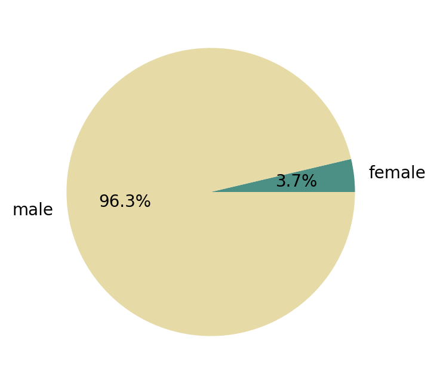

# No pie for you!

I've completed the goals set out in my first blog post.

<!-- more -->

Not very surprisingly the gender ratio of the Academy Awards for Best Picture is horrendous:

{width="300"}

As a fun side note: I've deliberately decided against using colors traditionally used to denote 
males and females.
Instead, I have used the colors beige (RBG: 230, 218, 166) and dusty teal (RGB: 76, 144, 133) as 
defined by the [XKCD color survey](https://www.w3schools.com/colors/colors_xkcd.asp).
The artist behind the XKCD web comic, Randall Munroe, did a survey a while back in which he showed his readers a bunch of colors and asked them to come up with names for them.
He also asked for the readers' chromosomal sex and used that data to find the color names most disproportionately popular among biological males and females.
The color most popular among biologically female survey responders was "dusty teal" and the one most 
popular among biologically male ones was a misspelling of "beige".
You can read the details [here](https://blog.xkcd.com/2010/05/03/color-survey-results/) under the "Sex" 
heading.
I recommend doing so, it's one of the most funny pieces of writing I know on the internet.
And it's all based on facts!

I'm going to keep my goals for the next update to the website simple:
I noticed that pie charts are not a good way to visualize continuous data such a movie run times.
The fact that I needed to divide them into the rather abitrary categories of "between 90 and 120 minutes", "between 120 and 150 minutes", etc. should have been a dead giveaway that this is not the best way to visualize this data.
I think I'm going to use what Seaborn calls a [swarm plot](https://seaborn.pydata.org/generated/seaborn.swarmplot.html#seaborn.swarmplot) instead.
This seems like a nice way to get an overview of the running time of your typical Best Picture winner.

So here is the goal for the next update:

- [ ] draw a swarm plot for the running times of Academy Award Best Picture winners