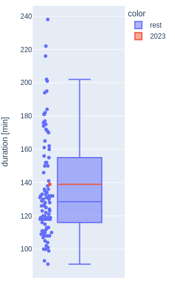

# All of the awards!

Well, four of them...

<!-- more -->

My longtime goal with this project was to display the data inside of an interactive dashboard.
I've chosen Plotly's [Dash](https://dash.plotly.com/) as the dashboard software.
I'm learning Dash by reading No Starch Press' [Book of Dash](https://nostarch.com/book-dash).

So far in my career I've used Matplotlib and Seaborn for plotting, but since Dash uses Plotly I'm switching to Plotly for this project.
My declared goal in the last blogpost was to...

- [ ] draw a [swarm plot](https://seaborn.pydata.org/generated/seaborn.swarmplot.html#seaborn.swarmplot) for the running times of Academy Award Best Picture winners

Well, Plotly does not have the Seaborn specific swarm plot figure type, so I switched to a boxplot with a scatter plot of all the data points by its side:

{width="300"}

The one point in red is the most recent round of Academy Awards, which - as I'm writing this - was in 2023.

When researching how to deploy a dashboard to a website I discovered that GitHub pages (where this website is currently hosted) only supports static websites.
However, dashboards require code to be run in the background, hence they are incompatible with GitHub pages - at least as far as I understand.
Luckily, Plotly has officially recommended [Render](https://render.com/) as a free hosting service for their dashboards, so I will deploy my dashboard via Render and link to it from this site.

My goal for the next time is to...

- [ ] deploy a dashboard version of the boxplot using Render
- [ ] add a dropdown menu to select the award to display

I'm expanding from one award (the oscars) to four.
The newly added awards are the Best Film awards from the [Big Three](https://en.wikipedia.org/wiki/List_of_film_festivals) festivals, i.e. Cannes, Venice and Berlin.
Let's see whether we will be able to see a difference in the lengths of the films awarded prices across the different festivals.
I doubt it, but it would be cool if it were true.
So here is hoping!
